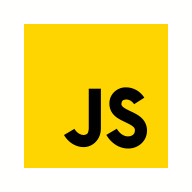
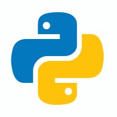

### Hi there 👋, I'm, ¡Roberto Cuellar 🤓!
---
Take a look to my portfalio (in progress)
Portfolio: [**Roberto Cuellar**](https://antonylozano.netlify.app/discography)

  **Languages and Tools**
   
  
  
  
   
   
   
  
  
  
  
  
  
  
    
  
  
  Icons by <a target="_blank" href="https://icons8.com">Icons8</a>

Thanks For Visit my Git Hub Page.  
Peace and Code! ♥
